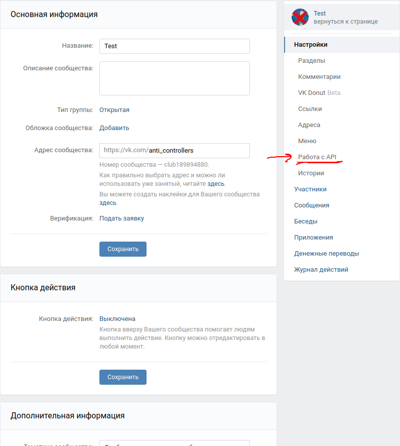
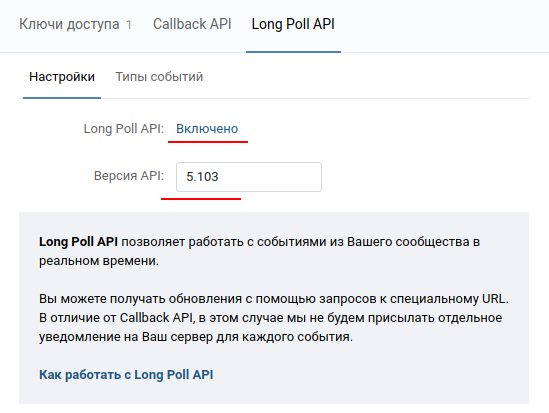
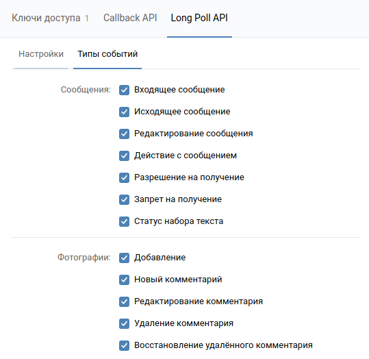
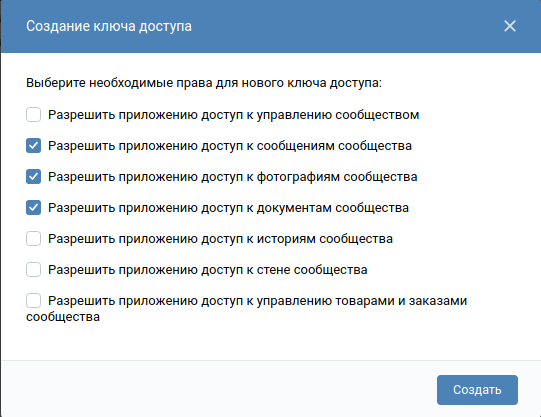

# ccam

Для работы необходим python-3.7

## Установка
```bash
python -m venv venv
source venv/bin/activate
pip install -r requirements.txt
```

## Перед запуском
Вставить в .env или env vk_token, camera_id
```bash
source venv/bin/activate
alembic upgrade head
```

## Запуск
```bash
source venv/bin/activate
python app/main.py
```

## Заполнение .env
1) Получение VK_API_TOKEN:  
Переходим в пункт Работа с API:
  
Переходим в пункт Long Poll API и включаем все как на скрине:
  
Выбираем все пункты как на скрине:
  
Во вкладке "Ключи доступа" нажимаем кнопку "создать ключ" и выбираем все пункты как на скрине:   
  

## Camera id
Получение все доступных id камер:
```bash
python cameras_id.py
```
Использование первой работающей камеры:  
camera_id = -1